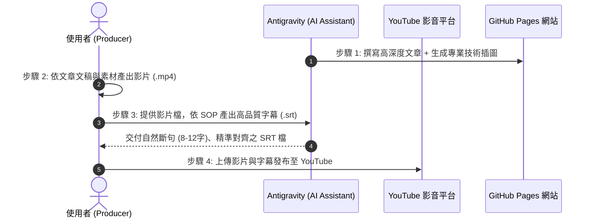

# 《科技歷史》專題寫作計畫書

> **計畫代號**：Project ChronoTech  
> **專案目標**：系統化盤點、收集並分類近代科技發展史上最關鍵的轉折事件、產品與文化，建立一套兼具技術深度與歷史人文敘事的長篇科技歷史文庫。

---

## 壹、 計畫願景與定位

科技並非憑空誕生，而是無數工程師、發明家與創業團隊在歷史機遇、市場博弈與技術瓶頸中撞擊出的火花。

本專案將聚焦於：
1. **技術脈絡（Why & How）**：當時遭遇了什麼難題？為何舊方法走不通？新技術底層邏輯是什麼？
2. **商業與人性博弈（Drama & Battle）**：巨頭之間的競爭、地下社群的顛覆力量、創業者的偏執與抉擇。
3. **歷史迴響（Impact & Legacy）**：這項科技如何永遠重塑了全球產業鏈與人類生活方式？

---

## 貳、 標題分類與候選選題庫（六大維度）

本計畫將主題劃分為 **六大領域分類**，總計收錄 42 個經典代表性專題：

### 【領域一：個人電腦與計算硬體革命】

*從大型機到每個人桌上與口袋中的微型電腦，硬體架構與晶片的黃金年代。*

1. **《Apple II 與車庫奇蹟：史蒂夫·沃茲尼克的電路詩篇與個人電腦的破曉》**
2. **《這場價值百萬的技術大劫案，逼賈伯斯向全世界的「老大哥」宣戰！Macintosh 1984 與圖形介面誕生》**
3. **《藍色巨人的世紀豪賭：IBM 怎麼親手把自己創造的 PC 帝國，拱手送給了相容機叛徒？》**
4. **《躺著收割全球三十年！微軟與英特爾的「邪惡同盟」是怎麼勒索整個科技界的？》**
5. **《八個天才的「叛逃」之約：一張五美元鈔票，如何砸開了整個矽谷半導體的黃金時代？》**
6. **《從破產邊緣到兆元霸主！黃仁勳是怎麼踩著 3Dfx 巫毒卡的屍體，殺出顯卡運算帝國的？》**
7. **《上過太空、摔不爛的黑色便當盒！日本大和實驗室的小紅點，憑什麼稱霸商務筆電三十年？》**
8. **《發表會前一秒隨時會當機！2007 年賈伯斯那場差點翻車的世紀大騙局，如何一夜埋葬諾基亞？》**

---

### 【領域二：數位媒體、編碼與娛樂變革】
*位元如何吞噬類比世界？壓縮演算法與數位格式引爆的娛樂海嘯。*

9. **《MP3 音訊革命：德國實驗室的聲學心理學、Napster 盜版浪潮與 iPod 救贖》**
10. **《一張照片差點毀掉整個網際網路！JPEG 專利勒索案與開源救世主 PNG 的秘密反擊》**
11. **《統治了所有網頁小遊戲與童年回憶，Flash 到底做錯了什麼，會被賈伯斯一紙公告判死刑？》**
12. **《差點被百視達笑著攆出門！Netflix 是怎麼用一包紅色郵寄光碟，活活把實體租片巨頭拖進墳墓？》**
13. **《把 500 張磁碟塞進一片塑膠片！CD-ROM 光碟如何引發多媒體狂潮，逼出《毀滅戰士》奇蹟？》**
14. **《燒光數十億美元的光碟內戰！Sony 藍光 vs 東芝 HD DVD，好萊塢片商是怎麼決定誰生誰死的？》**

---

### 【領域三：網際網路服務、搜尋與雲端生態】
*從資訊荒漠到資訊爆炸，重構人類獲取知識與溝通方式的雲端服務。*

15. **《愚人節最大「惡作劇」居然是真的！Google 扔出 1GB 免費郵箱，如何徹底顛覆了現代網頁？》**
16. **《不用再盯著紙本地圖迷路！Google 怎麼把中央情報局（CIA）的衛星黑科技，變成了人手一張的上帝視角？》**
17. **《如果他當年收一塊錢專利費，世界首富就不是比爾蓋茲！WWW 之父一念之仁的無私遺產》**
18. **《原本只是兩個史丹佛學生的破爛伺服器！PageRank 演算法是怎麼把雅虎的人工分類徹底掃進垃圾堆？》**
19. **《允許全世界任何人隨意修改的網站，居然把傳承兩百年的《大英百科全書》活生生打到停刊？》**
20. **《「不服從就滾蛋！」貝佐斯一封暴怒的 API 聖旨，如何意外替亞馬遜生出一隻印鈔機怪物？》**
21. **《「喔噢！」那個一響起就讓人心跳加速的提示音：ICQ 與 MSN 到底是如何偷走一整代人的青春？》**

---

### 【領域四：作業系統、平台與基礎軟體】
*支撐現代數位文明運轉的無形基石。*

22. **《披星戴月排隊只為買一張軟體光碟？Windows 95 發售那一天，比爾蓋茲究竟給全世界灌了什麼迷魂湯？》**
23. **《因為想在辦公室偷玩《星際旅行》遊戲，兩個天才工程師竟然順手敲出了統治世界的現代作業系統基石？》**
24. **《「這只是一個小愛好，不會太大……」芬蘭大學生的一句客套話，最後怎麼變成了吞噬微軟的企鵝帝國？》**
25. **《微軟史上最兇狠的割喉戰！比爾蓋茲如何用「免費綁架」絞殺網景，引發差點拆分微軟的世紀大審判？》**
26. **《差點賣給三星卻被當場嘲笑！這隻原本給相機用的綠色小機器人，最後是如何統治全球數十億手機？》**
27. **《太好用也是一種罪？那張藍天白雲綠草地的桌布背後，微軟為什麼花了整整十三年都殺不死 Windows XP？》**
28. **《惹毛天才是什麼下場？被商業公司收回免費授權後，林納斯閉關十天怒寫出拯救全世界程式設計師的 Git！》**

---

### 【領域五：科技文化、社群與黑客精神】
*推動技術演進的思想體系、次文化與反叛精神。*

29. **《從咬斷雞頭的馬戲團怪胎，到統治世界的矽谷新貴！「GEEK」這個標籤究竟是如何完成驚天逆襲的？》**
30. **《一個哨子就能免費打通全球電話！早期黑客們用口香糖吹哨玩具，如何撕開了巨頭電信網絡的遮羞布？》**
31. **《幼兒園車庫裡的技術狂歡：這群留著長髮、滿身焊錫味的嬉皮青年，是怎麼隨手改寫人類歷史的？》**
32. **《被美國國防部列為「走私軍火」的代碼！這群密碼學瘋子抗爭了三十年，最後把世界引向了比特幣》**
33. **《為什麼矽谷的傳奇神話非得誕生在破車庫裡？一場被科技巨頭包裝了半個世紀的「車庫崇拜」迷思》**
34. **《「你們在我們的世界毫無主權！」這份深夜寫在達沃斯酒吧的宣言，如何點燃了捍衛網路自由的第一把火？》**

---

### 【領域六：商業戰役、敗局與科技啟示錄】
*那些領先時代一步卻倒在黎明前的先驅，以及改寫商業規則的重大併購與失誤。*

35. **《親手發明了滑鼠、圖形介面與雷射印表機，全錄高層為什麼會把整個未來像白菜一樣白白送給賈伯斯？》**
36. **《全世界第一台數位相機居然是它發明的！百年黃色底片巨人柯達，為什麼會親手給自己釘上棺材板？》**
37. **《被微軟亂刀砍死在沙灘上之後，網景工程師是怎麼用一隻浴火重生的火狐狸（Firefox）展開十年復仇？》**
38. **《砸核桃的手機霸主轟然倒塌！諾基亞 CEO 那封著名的「燃燒的鑽油平台」備忘錄，到底有多絕望？》**
39. **《嫌 100 萬美元太貴拒絕買 Google！曾經的網路之神雅虎，究竟是如何精準踩中每一個自毀陷阱？》**
40. **《被成人影業狠狠背刺？Sony 在錄影帶大戰輸給 VHS、又在 MP3 時代自廢武功的慘痛教訓》**
41. **《911 襲擊中全美唯一沒斷線的救命神機！黑莓是怎麼傲慢地嘲笑 iPhone「沒有實體鍵盤根本活不下去」？》**
42. **《「網路就是電腦！」二十年前就預見了雲端時代的超級先知 Sun，為什麼最後落得被甲骨文廉價收購？》**

---

## 參、 文章統一撰寫架構（單篇標準規格）

每篇文章預計以 **3,000 ~ 4,500 字** 的長文深度呈現，採用一致的結構模組：

```markdown
# [主題名稱]：[主標題 / 副標題]

> **時代座標**：年代區間（例如：1987 - 2001）
> **領銜人物**：關鍵技術人物 / 創辦人 / 團隊
> **核心突破**：一句話總結其帶來的破壞式創新或技術突破

---
### 一、 時代迷霧：誕生前的世界與瓶頸
- 舊技術極限、時代痛點或既有生活型態。

### 二、 破土而出：實驗室、車庫與核心技術攻堅
- 原型開發、核心演算法或電路設計的關鍵突破細節。

### 三、 引爆點：產品發佈與商業市場洗牌
- 進入大眾視野的歷史現場、競爭對手的反擊與應對。

### 四、 深遠迴響：它如何徹底改寫了現代文明？
- 對產業上下游、工程師文化或人類日常行為的重塑。

### 五、 關鍵歷史大事記（Timeline）
- 條列式核心年表，便於快速回顧。

### 參考資料與文獻清單
- 權威傳記、第一手口述歷史、原始技術專利或論文。
```

---

## 肆、 專案檔案組織架構

```text
c:\Antigravity\科技歷史\
├── 00_專案計畫與目錄/
│   ├── 科技歷史寫作計畫書.md    <-- 本文件
│   └── 文章標準模板_TEMPLATE.md
│
├── 01_個人電腦與計算硬體/
├── 02_數位媒體與編碼/
├── 03_網際網路與雲端服務/
├── 04_作業系統與基礎軟體/
├── 05_科技文化與黑客精神/
├── 06_商業戰役與科技啟示/
└── README.md                  <-- 成果總覽與閱讀導航
```

---

## 伍、 分階段推進規劃

1. **第一階段（奠基與標竿篇）**：
   - 先選定 3 篇最具話題度與代表性的主題（例如：《MP3 音訊革命》、《GEEK 極客精神》、《Gmail 誕生記》），打造示範級標準文章，確立敘事節奏與深度。
2. **第二階段（PC 與作業系統雙雄）**：
   - 聚焦個人電腦大爆發（《Apple II / Macintosh》、《IBM PC 與 Wintel》、《Windows 95 狂潮》）。
3. **第三階段（網路與雲端深化）**：
   - 全面展開 Google Maps、WWW、Linux、AWS 等基礎設施與服務篇章。

---

## 陸、 影音化聯動製作標準流程（四步閉環）

本專案不僅產出靜態網站與技術長文，亦將同步推進至影音多媒體（YouTube），具體協作閉環流程如下：



1. **步驟 1：文章撰寫與視覺生成（AI Agent）**
   - 深入調研歷史背景與技術底層原理，依 RDQ 規格產出引人入勝的非虛構技術長文。
   - 伴隨高品質、高解析度技術藍圖／架構示意圖（生圖風格 A：復古未來主義技術藍圖風格）。
   - 自動同步發布至 GitHub Pages 靜態網站。
2. **步驟 2：影音多媒體製作（User）**
   - 使用者依據產出的專題文章進行剪輯、配音或生成旁白，產出影音成品（`.mp4`）。
3. **步驟 3：字幕生成與強制對齊（AI Agent ＋ User 協同）**
   - 依循 `SOP_高品質YouTube字幕製作規範.md` 執行四階段字幕處理：
     - 語音特徵提取（Whisper word timestamps）。
     - 人類口語呼吸斷句（8～12 字黃金長度、固定詞彙絕不腰斬）。
     - 人機協同文字校對（使用者確認文字與同音錯字）。
     - 強制對齊（Forced Alignment）生成精準時間軸 UTF-8-BOM `.srt`。
4. **步驟 4：發布與整合（User）**
   - 使用者將影片與 `.srt` 字幕檔上傳發布至 YouTube，並可將 YouTube 播放清單／影片嵌入回網站文章，實現文字與影音雙向賦能。

