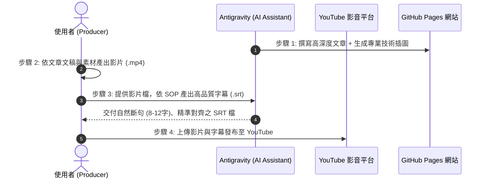

# 《科技歷史》專題寫作計畫書

> **計畫代號**：Project ChronoTech  
> **專案目標**：系統化盤點、收集並分類近代科技發展史上最關鍵的轉折事件、產品與文化，建立一套兼具技術深度與歷史人文敘事的長篇科技歷史文庫。

---

## 壹、 計畫願景與定位

科技並非憑空誕生，而是無數工程師、發明家與創業團隊在歷史機遇、市場博弈與技術瓶頸中撞擊出的火花。

本專案將聚焦於：
1. **技術脈絡（Why & How）**：當時遭遇了什麼難題？為何舊方法走不通？新技術底層邏輯是什麼？
2. **商業與人性博弈（Drama & Battle）**：巨頭之間的競爭、地下社群的顛覆力量、創業者的偏執與抉擇。
3. **歷史迴響（Impact & Legacy）**：這項科技如何永遠重塑了全球產業鏈與人類生活方式？

---

## 貳、 標題分類與候選選題庫（六大維度）

本計畫將主題劃分為 **六大領域分類**，總計收錄 42 個經典代表性專題：

### 【領域一：個人電腦與計算硬體革命】
*從大型機到每個人桌上與口袋中的微型電腦，硬體架構與晶片的黃金年代。*

1. **《Apple II 與車庫奇蹟：史蒂夫·沃茲尼克的電路詩篇與個人電腦的破曉》**
2. **《Macintosh 1984：圖形介面（GUI）、滑鼠與向「老大哥」宣戰的革命》**
3. **《IBM PC 的反客為主：開放架構的豪賭與相容機帝國的誕生》**
4. **《Wintel 雙雄記：Intel 處理器與微軟軟體的黃金同盟與霸權三十年》**
5. **《電晶體與矽谷黎明：快捷半導體（Fairchild）的「八叛徒」與摩爾定律》**
6. **《GPU 崛起與光影革命：從 3Dfx Voodoo 巫毒卡到 NVIDIA 的運算帝國》**
7. **《ThinkPad 黑盒子傳奇：日本大和實驗室的精工、小紅點與商務筆電之王》**
8. **《智慧型手機奇異點：iPhone 2007 發表會背後的工程豪賭與黑莓、諾基亞的黃昏》**

---

### 【領域二：數位媒體、編碼與娛樂變革】
*位元如何吞噬類比世界？壓縮演算法與數位格式引爆的娛樂海嘯。*

9. **《MP3 音訊革命：德國實驗室的聲學心理學、Napster 盜版浪潮與 iPod 救贖》**
10. **《JPEG 與 PNG 的誕生：讓互聯網看得見的影像壓縮與專利防禦戰》**
11. **《Flash 興衰錄：向量動畫、網頁小遊戲時代的狂歡與賈伯斯的一紙討伐文》**
12. **《串流媒體先驅：RealPlayer 的掙扎與 Netflix 郵寄 DVD 到雲端串流的逆襲》**
13. **《CD-ROM 與多媒體風暴：從《毀滅戰士》到百科全書，光碟如何重塑遊戲與軟體載體》**
14. **《H.264 與高畫質影音：藍光 vs HD DVD 世紀大戰與串流編碼標準統一》**

---

### 【領域三：網際網路服務、搜尋與雲端生態】
*從資訊荒漠到資訊爆炸，重構人類獲取知識與溝通方式的雲端服務。*

15. **《Gmail 誕生記：愚人節的 1GB 震撼、保羅·布克海特與 Ajax 動態網頁革命》**
16. **《Google Maps 的前世今生：從 2D 呆板地圖到收購 Where 2 Tech、Keyhole 打造衛星地球》**
17. **《全球資訊網（WWW）誕生：提姆·柏內茲-李在 CERN 的一念之仁與無私開源》**
18. **《搜尋引擎演進史：從雅虎目錄分類、AltaVista 到 Google PageRank 演算法統治》**
19. **《維基百科的奇蹟：吉米·威爾斯、集體智慧與大英百科全書的神話破滅》**
20. **《Amazon AWS 雲端帝國：貝佐斯的「API 聖旨」如何意外催生現代雲端運算》**
21. **《即時通訊演變史：從 ICQ、MSN Messenger、Yahoo 即時通到現代通訊軟體》**

---

### 【領域四：作業系統、平台與基礎軟體】
*支撐現代數位文明運轉的無形基石。*

22. **《Windows 95 狂潮：徹夜排隊買作業系統、Start 按鈕與微軟的巔峰時代》**
23. **《UNIX 傳奇：貝爾實驗室的閒暇之作與哲學：小即是美、一切皆是檔案》**
24. **《Linux 誕生記：林納斯·托瓦茲的大學客廳專案與自由開源軟體運動的勝利》**
25. **《第一次瀏覽器大戰：微軟 IE 捆綁策略如何絞殺網景（Netscape）引發反壟斷世紀審判》**
26. **《Android 崛起史：從數位相機作業系統到被 Google 收購、對抗 iOS 的開源綠巨人》**
27. **《Windows XP 與「經典」的代價：極致穩定、安全中心危機與長達十餘年的退場拉鋸》**
28. **《Git 與版本控制的史詩：Linux 核心維護危機逼出林納斯的十天奇蹟》**

---

### 【領域五：科技文化、社群與黑客精神】
*推動技術演進的思想體系、次文化與反叛精神。*

29. **《GEEK 極客精神：從馬戲團怪胎、書呆子標籤到統治世界的矽谷新階級》**
30. **《黑客倫理（Hacker Ethic）：MIT 鐵道模型俱樂部、電話飛客（Phreaker）與資訊自由之魂》**
31. **《自製電腦俱樂部（Homebrew Computer Club）：矽谷車庫神話的真正孵化器》**
32. **《Cypherpunk 密碼龐克狂潮：加密無罪、隱私保衛戰到中本聰的比特幣白皮書》**
33. **《矽谷車庫文化考：從 HP 惠普車庫、喬布斯車庫到創業符號的誕生》**
34. **《電子前哨基金會（EFF）與數位人權：約翰·佩里·巴洛的《賽博空間獨立宣言》》**

---

### 【領域六：商業戰役、敗局與科技啟示錄】
*那些領先時代一步卻倒在黎明前的先驅，以及改寫商業規則的重大併購與失誤。*

35. **《全錄 PARC（施樂帕克研究中心）：發明了未來卻拱手送給賈伯斯與蓋茲的悲劇天才》**
36. **《柯達的數位困境：發明了全球第一台數位相機，卻親手將自己送進墳墓》**
37. **《網景通訊（Netscape）的最後一搏：Mozilla 鳳凰涅槃與 Firefox 的開源復仇》**
38. **《諾基亞塞班帝國的崩塌：智慧型手機前夜的組織自滿與燃燒的平台》**
39. **《雅虎（Yahoo!）錯過的時代：三次足以買下 Google、Facebook 的歷史交叉口》**
40. **《Sony 的格式戰爭：從 Betamax vs VHS 到 MD 隨身聽在 MP3 時代的迷失》**
41. **《黑莓機（BlackBerry）與按鍵輓歌：九一一事件的通訊英雄如何敗給全觸控時代》**
42. **《太陽微系統（Sun Microsystems）：網路即電腦（The Network is the Computer）的先知悲歌》**

---

## 參、 文章統一撰寫架構（單篇標準規格）

每篇文章預計以 **3,000 ~ 4,500 字** 的長文深度呈現，採用一致的結構模組：

```markdown
# [主題名稱]：[主標題 / 副標題]

> **時代座標**：年代區間（例如：1987 - 2001）
> **領銜人物**：關鍵技術人物 / 創辦人 / 團隊
> **核心突破**：一句話總結其帶來的破壞式創新或技術突破

---
### 一、 時代迷霧：誕生前的世界與瓶頸
- 舊技術極限、時代痛點或既有生活型態。

### 二、 破土而出：實驗室、車庫與核心技術攻堅
- 原型開發、核心演算法或電路設計的關鍵突破細節。

### 三、 引爆點：產品發佈與商業市場洗牌
- 進入大眾視野的歷史現場、競爭對手的反擊與應對。

### 四、 深遠迴響：它如何徹底改寫了現代文明？
- 對產業上下游、工程師文化或人類日常行為的重塑。

### 五、 關鍵歷史大事記（Timeline）
- 條列式核心年表，便於快速回顧。

### 參考資料與文獻清單
- 權威傳記、第一手口述歷史、原始技術專利或論文。
```

---

## 肆、 專案檔案組織架構

```text
c:\Antigravity\科技歷史\
├── 00_專案計畫與目錄/
│   ├── 科技歷史寫作計畫書.md    <-- 本文件
│   └── 文章標準模板_TEMPLATE.md
│
├── 01_個人電腦與計算硬體/
├── 02_數位媒體與編碼/
├── 03_網際網路與雲端服務/
├── 04_作業系統與基礎軟體/
├── 05_科技文化與黑客精神/
├── 06_商業戰役與科技啟示/
└── README.md                  <-- 成果總覽與閱讀導航
```

---

## 伍、 分階段推進規劃

1. **第一階段（奠基與標竿篇）**：
   - 先選定 3 篇最具話題度與代表性的主題（例如：《MP3 音訊革命》、《GEEK 極客精神》、《Gmail 誕生記》），打造示範級標準文章，確立敘事節奏與深度。
2. **第二階段（PC 與作業系統雙雄）**：
   - 聚焦個人電腦大爆發（《Apple II / Macintosh》、《IBM PC 與 Wintel》、《Windows 95 狂潮》）。
3. **第三階段（網路與雲端深化）**：
   - 全面展開 Google Maps、WWW、Linux、AWS 等基礎設施與服務篇章。

---

## 陸、 影音化聯動製作標準流程（四步閉環）

本專案不僅產出靜態網站與技術長文，亦將同步推進至影音多媒體（YouTube），具體協作閉環流程如下：



1. **步驟 1：文章撰寫與視覺生成（AI Agent）**
   - 深入調研歷史背景與技術底層原理，依 RDQ 規格產出引人入勝的非虛構技術長文。
   - 伴隨高品質、高解析度技術藍圖／架構示意圖（生圖風格 A：復古未來主義技術藍圖風格）。
   - 自動同步發布至 GitHub Pages 靜態網站。
2. **步驟 2：影音多媒體製作（User）**
   - 使用者依據產出的專題文章進行剪輯、配音或生成旁白，產出影音成品（`.mp4`）。
3. **步驟 3：字幕生成與強制對齊（AI Agent ＋ User 協同）**
   - 依循 `SOP_高品質YouTube字幕製作規範.md` 執行四階段字幕處理：
     - 語音特徵提取（Whisper word timestamps）。
     - 人類口語呼吸斷句（8～12 字黃金長度、固定詞彙絕不腰斬）。
     - 人機協同文字校對（使用者確認文字與同音錯字）。
     - 強制對齊（Forced Alignment）生成精準時間軸 UTF-8-BOM `.srt`。
4. **步驟 4：發布與整合（User）**
   - 使用者將影片與 `.srt` 字幕檔上傳發布至 YouTube，並可將 YouTube 播放清單／影片嵌入回網站文章，實現文字與影音雙向賦能。

