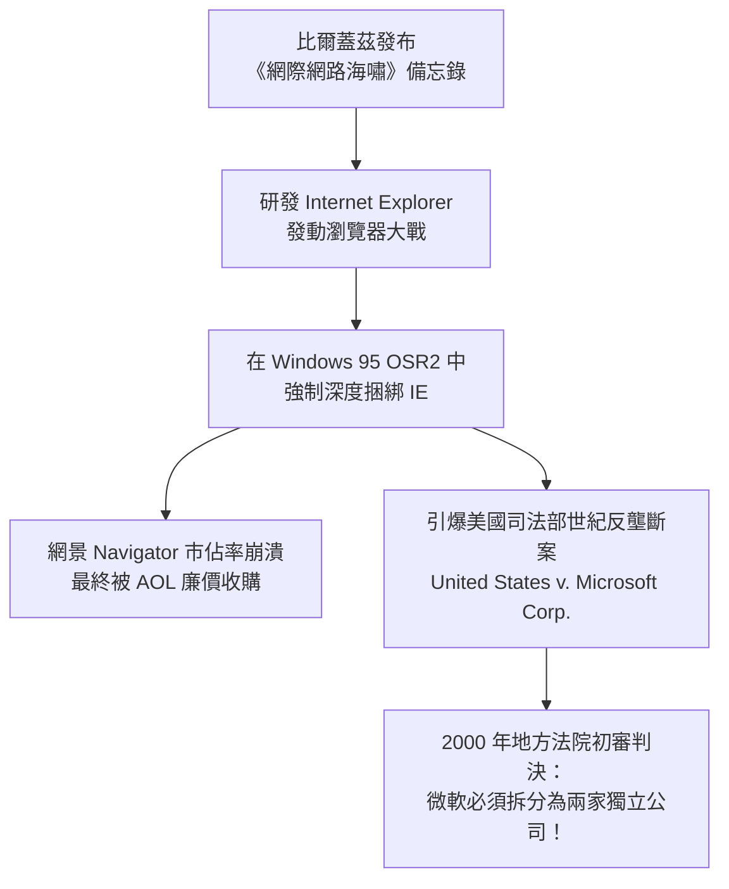

# 披星戴月排隊只為買一張軟體光碟？Windows 95 發售那一天，比爾蓋茲究竟給全世界灌了什麼迷魂湯？

> **時代座標**：1993 年 - 1996 年  
> **領銜人物**：比爾·蓋茲（Bill Gates）、布拉德·西爾弗伯格（Brad Silverberg）、布萊恩·伊諾（Brian Eno）、史蒂夫·鮑爾默（Steve Ballmer）  
> **核心突破**：終結 MS-DOS 時代長達十餘年的 16 位元實模式枷鎖與 640KB 記憶體地獄，建立 32 位元搶佔式多工架構。以「開始」按鈕、工作列、長檔名與隨插即用（Plug and Play）奠定了往後三十年的現代作業系統人機互動範式；更以一場豪擲三億美元、史無前例的全球文化行銷海嘯，將個人電腦由小眾商務工具徹底推向全人類流行文化的權力巔峰。


---

## 一、 時代迷霧：16 位元 DOS 泥沼與 640KB 的人間地獄

如果你穿越回 1994 年，走進任何一間擺放著個人電腦的房間，你所感受到的絕對不是科技帶來的優雅與從容，而是一種令人近乎窒息的挫折感。

當時全球絕大多數 PC 運行的是微軟的 **MS-DOS**，或者在其之上勉強覆蓋著一層薄弱的圖形外殼——**Windows 3.1**。對於那個時代的使用者而言，開機從來不是享受，而是一場痛苦的儀式：

```text
【1990 年代初 PC 使用者的日常惡夢】
┌────────────────────────────────────────────────────────┐
│ C:\> CHKDSK                                            │
│ 655,360 total conventional memory                      │
│ 580,240 bytes available (不足！無法啟動遊戲/大型軟體！)│
│                                                        │
│ 記憶體天花板：不可逾越的 640KB 限制                    │
│ 驅動地獄：手動調撥中斷 IRQ 7、DMA 通道、跳線（Jumper） │
│ 檔名限制：8.3 格式（DOCUMENT1.DOC、MYPROJ~1.TXT）      │
│ 當機代價：協同式多工，一個程式凍結，整台電腦直接藍屏死機│
└────────────────────────────────────────────────────────┘
```

### 1. 致命的 640KB 記憶體牢籠（Conventional Memory Barrier）
在 IBM PC 誕生初期，微軟與 IBM 將記憶體架構劃分為：前 640KB 為「常規記憶體」（Conventional Memory），供作業系統與應用程式執行；640KB 至 1MB 則保留給硬體 BIOS 與視訊記憶體。

比爾·蓋茲那句相傳的「640KB 記憶體對任何人來說都足夠了」（儘管他本人多次否認說過這句話），在 1990 年代初成了一場真實的科技悲劇。當時即使你的電腦插滿了昂貴的 4MB 或 8MB 記憶體，DOS 依然只能在狹窄的 640KB 空間裡苟延殘喘。

為了玩一款新的 DOS 遊戲或運行大型試算表，全世界數百萬名使用者被迫自學成半個系統工程師。每個人都有一套秘傳的記憶體優化偏方：在 `CONFIG.SYS` 和 `AUTOEXEC.BAT` 裡手動載入 `HIMEM.SYS` 與 `EMM386.EXE`，用 `DEVICEHIGH` 與 `LOADHIGH` 指令，像玩俄羅斯方塊一樣錙銖必較，只為從 640KB 裡多擠出 8KB 的可用空間。只要順序排錯，迎接你的就是冷酷的黑底白字：`Out of memory`。

### 2. 隨插即「咒」的驅動地獄
在那個時代，為電腦安裝一塊新的音效卡（如著名的 Sound Blaster 16）或外接光碟機，堪比一場外科手術。

使用者必須手拿金屬鑷子，對著電路板上的金屬針腳小心翼翼地拔插跳線（Jumper），手動指派中斷請求號碼（IRQ 3、IRQ 5、IRQ 7）與直接記憶體存取通道（DMA Channel）。一旦音效卡跟網路卡或印表機埠的 IRQ 衝突，電腦便會瞬間啞巴甚至無法開機。當時的硬體安裝被工程師戲稱為「隨插即咒」（Plug and Pray——插上去，然後祈禱它能動）。

### 3. 虛假的「多工」：一損俱損的協同式崩潰
雖然 Windows 3.1 帶來了滑鼠與視窗，但其底層本質上依然只是 MS-DOS 的「保護模式外殼」。它採用的排程機制是極其脆弱的**協同式多工（Cooperative Multitasking）**——作業系統根本沒有真正的控制權，必須仰賴應用程式「自願」交出 CPU 使用權。

只要某個試算表軟體在後台進行一項複雜的計算，或者通信軟體在撥號連線時卡住，整個作業系統的滑鼠游標就會變成一個靜止的沙漏，全螢幕凍結；任何一個小程式越界存取記憶體，便會觸發致命的一般性保護錯誤（General Protection Fault），整台電腦瞬間癱瘓，正在編輯的文件化為烏有。

全世界的個人電腦使用者，都在引頸期盼一場真正的技術救贖。

---

## 二、 破土而出：代號「芝加哥」（Project Chicago）的系統級大換血

1992 年底，微軟雷德蒙德（Redmond）總部瀰漫著空前的緊張氣氛。

當時微軟內部正在推動兩個截然不同的作業系統專案：
- 由傳奇架構師戴夫·卡特勒（Dave Cutler）主導的 **Windows NT**：這是一套血統純正、完全重寫的純 32 位元企業級巨獸，穩定、強大，但對硬體要求極為苛刻，且完全無法相容成千上萬既有的 DOS 遊戲與消費級軟體；
- 另一個則是代號為**「芝加哥」（Project Chicago）**的秘密專案，目標是打造一套面向全球主流消費大眾的下一代個人電腦作業系統。

「芝加哥」專案的掌舵人是微軟個人系統部門副總裁**布拉德·西爾弗伯格（Brad Silverberg）**。西爾弗伯格向團隊提出了一個在當時看來簡直是天方夜譚的雙重使命：
> **「我們既要給全世界帶來一套真正的 32 位元搶佔式多工現代系統，又必須向後相容世界上所有的 DOS 軟體與 Windows 3.1 程式！」**

```mermaid
graph TD
    subgraph Windows 95 混合核心架構 (Hybrid Architecture)
        subgraph 應用程式層 (User Mode)
            A1[32位元 Win32 應用程式<br/>Word, Excel, Doom] 
            A2[16位元 既有舊軟體<br/>Win16 / DOS 遊戲]
        end
        
        subgraph 核心服務層
            B1[USER32 / GDI32<br/>視窗繪圖與事件分發]
            B2[KERNEL32<br/>記憶體分配 / 執行緒排程]
            T[Thunking Layer 轉換層<br/>32位元與16位元指針轉換]
        end
        
        subgraph 核心層 (Kernel Mode)
            C1[VMM32 虛擬記憶體管理器<br/>4GB 平坦虛擬位址空間]
            C2[搶佔式排程器 Preemptive Scheduler]
            C3[VxD 虛擬裝置驅動程式]
            D[MS-DOS 7.0 啟動與相容支援]
        end
        
        A1 --> B1
        A1 --> B2
        A2 --> T
        T --> B1
        T --> B2
        B1 --> C1
        B2 --> C2
        C1 --> C3
        C2 --> D
    end
```

這是一場在鋼絲上跳舞的極限工程冒險。為了達成這個目標，西爾弗伯格帶領數百名頂尖工程師進行了長達三年的技術攻堅：

### 1. 32 位元平坦記憶體模型與搶佔式多工
Windows 95 徹底拋棄了 DOS 時代惡名昭彰的記憶體分段機制（Memory Segmentation），導入了針對 Intel 80386 及以上處理器的 **32 位元平坦位址空間（Flat Address Space）**。每個 32 位元應用程式都擁有了獨立且虛擬的 4GB 記憶體空間，再也不需要去管什麼 640KB 常規記憶體、擴充記憶體（EMS）或延伸記憶體（XMS）。

更關鍵的是**搶佔式多工（Preemptive Multitasking）**的實現。作業系統擁有了至高無上的控制權，CPU 執行時間被切成毫秒級的微小時間片，由系統核心強制分配給各個執行緒。就算某個應用程式陷入死循環或崩潰，使用者依然可以輕快地拖曳滑鼠游標，甚至按下鍵盤上的組合鍵切換到其他視窗。這是有史以來第一次，個人電腦在一般家庭與辦公室中展現出了如工作站般沉穩流暢的底氣。

### 2. 隨插即用（Plug and Play）：硬體統一戰線
為了終結跳線與 IRQ 衝突，微軟聯手英特爾（Intel）、康柏（Compaq）與鳳凰科技（Phoenix Technologies），共同制定了革命性的 **Plug and Play（PnP）** 架構。

在 Windows 95 底層，內建了對 PCI 匯流排與隨插即用裝置的全面支援。系統核心會主動向主機板與擴充卡查詢硬體識別碼（Hardware ID），自動調配沒有被佔用的中斷請求（IRQ）與記憶體位址，並在背後默默載入對應的虛擬裝置驅動程式（VxD）。當使用者把一塊新的音效卡插進電腦、按下電源開關，螢幕上彈出**「發現新硬體」**的那一刻，整個個人電腦硬體工業徹底告別了蒙昧的手工調試時代。

---

## 三、 介面革命：那個按了才能關機的「開始」選單


如果說 32 位元架構與隨插即用是 Windows 95 強悍的骨骼與內臟，那麼它的**使用者介面（GUI）**，則是一場徹底重塑人類與數位世界交互邏輯的偉大藝術。

在 Windows 3.1 時代，使用者面對的是雜亂無章的「程式管理員」（Program Manager）。各個應用程式圖示被隨意塞在不同的子視窗裡，視窗一旦最小化，就會變成一堆零碎的方塊堆在螢幕底端，一旦被大視窗遮擋便音訊全無。

微軟的人機互動工程師與認知心理學家組成了龐大的可用性實驗室（Usability Lab）。他們邀請了數百名從未碰過電腦的普通家庭主婦、學生與退休老人，透過單向透視玻璃進行了數千小時的眼動追蹤與操作測試。最終，誕生了統治現代電腦桌面長達三十年的三大交互支柱：

```text
┌────────────────────────────────────────────────────────────────────────┐
│ [我的電腦]    [資源回收筒]   [網路芳鄰]                                │
│                                                                        │
│                                                                        │
│                       【革命性的現代桌面典範】                         │
│                                                                        │
│                                                                        │
├────────────────────────────────────────────────────────────────────────┤
│ [開始 Start] │ [W Microsoft Word] [試算表.xls] │ [音量] [輸入法] 08:24 PM│
└────────────────────────────────────────────────────────────────────────┘
  ▲               ▲                                ▲
  │               │                                │
  第一支柱：      第二支柱：工作列                 第三支柱：系統匣通知區
  「我要去哪？」  「我現在正在開什麼？」           「後台發生了什麼事？」
```

### 1. 「開始」按鈕（Start Menu）：為迷失的使用者點亮燈塔
實驗室測試發現，新手面對空白螢幕時最大的焦慮是：**「我不知道第一步該點哪裡。」**

微軟的設計師創造了一個大膽而優雅的解答：在螢幕左下角放置一個永遠懸浮、標記著微軟四色旗幟的按鈕，上面只有一個單純而堅定的動詞——**「開始」（Start）**。

無論你想寫文章、玩接龍、搜尋檔案還是更改設定，只要點擊「開始」，所有的應用程式階層式地展開於眼前。甚至，為了體現對使用者的無微不至，微軟連關閉電腦的指令也放在了這裡——這催生了一個流傳至今的科技經典幽默：**「你要先按『開始』，才能關閉電腦。」**

### 2. 工作列（Taskbar）：真正的後台可見化
在 Windows 95 之前，多工切換極其繁瑣。Windows 95 在螢幕底端固定了一條**工作列**，每一個正在執行的程式都在上面佔有一個長方形的按鈕。

使用者無需再記住複雜的快捷鍵，只需用滑鼠輕輕一點，視窗便能瞬間在前台與後台之間流暢切換。工作列右下角更開闢了「系統匣」（System Tray），時鐘、音量控制器、網路連線狀態一目了然。

### 3. 長檔名（Long File Names）與資源回收筒（Recycle Bin）
Windows 95 徹底摧毀了 DOS 時代冷酷的「8.3 格式」。透過 VFAT 檔案系統的精妙設計，使用者終於可以用多達 255 個中文字元命名自己的檔案：
- 過去：`FINREP95.XLS`
- 現在：`1995年第三季財務報表修訂終極版.xls`

此外，為了消除使用者誤刪檔案的恐慌，微軟導入了「資源回收筒」概念。檔案被刪除後不會立刻灰飛煙滅，而是安靜地躺在回收筒裡等待挽回。這種對人類心理弱點的同理與包容，讓電腦第一次有了「溫度」。

### 4. Brian Eno 與那段 3.25 秒的開機微雕神曲
為了洗去電腦冷冰冰的機器味，微軟邀請了世界頂尖的環境音樂大師**布萊恩·伊諾（Brian Eno）**為系統製作開機音效。

微軟給出的需求嚴苛到近乎荒謬：「這段音樂必須富有啟發性、博愛、樂觀、未來感、情感豐沛，而且長度必須嚴格控制在 **3.25 秒**以內。」

伊諾後來回憶道：「這就像用微雕技術在一顆米粒上雕刻整座巴黎聖母院。」他嘗試了 84 個版本，最終打造出了那段由清脆的鋼琴泛音、溫潤的合成器弦樂交織而成、如同晨曦穿透雲層般的經典聲音——**「The Microsoft Sound」**。有趣的是，這位音樂大師多年後坦言，這段載入科技史冊的微軟開機音效，是他**在一台蘋果 Macintosh 電腦上譜寫完成的**。

---

## 四、 狂歡之夜：1995 年 8 月 24 日——史上最瘋狂的科技嘉年華

1995 年 8 月 24 日，人類歷史上發生了一場前所未見的文化奇觀。

在那一天之前，軟體只是一種放在灰暗貨架上、只有程式設計師和辦公室白領才會購買的塑膠光碟或磁片；但從那一天起，軟體變成了一種席捲全球流行文化的集體信仰。

比爾·蓋茲與史蒂夫·鮑爾默（Steve Ballmer）為 Windows 95 的全球發售批准了高達 **3 億美元**的行銷預算（相當於今天的近 6 億美元）。這在當時的軟體業是一個聞所未聞的天文數字。微軟以好萊塢大片上映、甚至披頭四巡迴演唱會的狂熱規格，向全人類發動了一場無死角的視聽轟炸：

```text
【Windows 95 全球地標行銷風暴】
- 紐約帝國大廈：首次被商業公司包下，點亮象徵微軟的「紅、黃、綠、藍」四色巨型霓虹燈
- 英國多佛白崖：投射出數百英尺高的巨大 Windows 95 標誌，照亮英吉利海峽
- 倫敦《泰晤士報》：微軟全額包下當天 150 萬份報紙，免費發送給全英國通勤族
- 滾石樂團名曲《Start Me Up》：微軟豪擲傳聞 800 萬美元買下版權，作為「開始」按鈕主題曲
- 史上第一部喜劇錄影帶教學片：邀請《六人行》巨星珍妮佛·安妮斯頓與馬修·派瑞親自出演
```

### 1. 滾石樂隊的《Start Me Up》與搖滾風暴
當微軟找上傳奇搖滾樂隊滾石樂團（The Rolling Stones），希望能將他們 1981 年的冠軍單曲《Start Me Up》作為全球電視廣告主題曲時，主唱米克·傑格（Mick Jagger）一開始根本不屑一顧。但微軟直接開出了一張無法拒絕的巨額支票（據報導在 300 萬至 800 萬美元之間），成為滾石樂隊史上第一次將歌曲授權給商業廣告使用。

「*Start me up! If you start me up, I'll never stop!*」伴隨著強烈的電吉他節奏與充滿荷爾蒙的嘶吼，電視機前的全球觀眾看著螢幕上那個不斷彈跳、綻放的「開始」按鈕，腦海中的多巴胺被徹底引爆。

### 2. 8 月 23 日午夜：不眠之夜的搶購狂潮
在 8 月 23 日深夜，全球各地的電腦零售巨頭（如美國的 CompUSA、Best Buy、英國的 PC World）前，出現了只有在搖滾音樂節或《星際大戰》首映會才能看見的景象：

數以萬計的普通民眾，在微涼的夜風中裹著毛毯、坐在折疊椅上徹夜排隊。當午夜 12 點的鐘聲敲響，店門大開，人群如同潮水般湧向貨架。許多人懷裡緊緊抱著那個印有藍天白雲圖案、沉甸甸的紙盒子，臉上洋溢著過節般的興奮。

荒謬而又感人的是，**在排隊搶購的人群中，有相當一部分人家裡根本連電腦都沒有，或者他們的電腦根本沒有光碟機**——但在那個狂熱的夜晚，沒有人關心相容性或硬體配備，所有人都深信：如果你的客廳或書桌上沒有擺著一個 Windows 95 的盒子，你就會被整個數位文明的未來無情拋下。

```text
【發售現場的奇蹟數字】
- 前 4 天全球銷量突破：100 萬套
- 前 5 週累計銷量達到：700 萬套
- 發售第一年總銷量突破：4,000 萬套
- 全球個人電腦裝機普及率：由 1995 年底的 10% 飆升至 1997 年的 80% 以上
```

在華盛頓州雷德蒙德的微軟園區內，比爾·蓋茲站在巨大的摩天輪前，身穿休閒毛衣，面對來自五大洲的 2,500 多名記者與嘉賓，露出了征服世界般的燦爛笑容。那是 39 歲的比爾·蓋茲人生最輝煌的高光時刻，那一刻，他不僅坐穩了世界首富的寶座，更成為了整個數位時代無可爭議的上帝。

---

## 五、 帝國的陰影：網際網路海嘯與世紀反壟斷風暴


然而，在 Windows 95 烈火烹油的盛世狂歡背後，一場足以傾覆微軟帝國的巨大暗流正在地表之下瘋狂湧動。

令人難以置信的是，作為當時全世界最先進的作業系統，**1995 年 8 月發售的 Windows 95 原始零售光碟裡，居然沒有內建網際網路瀏覽器，甚至連 TCP/IP 協議都不是預設安裝的選項！**

### 1. 致命的戰略近視：微軟差點錯過網際網路
在研發「芝加哥」的早期，比爾·蓋茲與微軟高層將注意力完全放在了本機作業系統與專有封閉網路——**The Microsoft Network（MSN）** 上。微軟原以為未來的人們會像訂閱美國線上（AOL）那樣，透過微軟的專用通道連接數位世界。

然而，1994 年底由馬克·安德森（Marc Andreessen）等人創立的**網景公司（Netscape）**，攜帶著 **Netscape Navigator** 瀏覽器掀起了開放式網際網路的海嘯。網景瀏覽器以幾何級數在全世界擴散，安德森甚至狂妄地向媒體宣稱：
> **「在不久的將來，網際網路瀏覽器將演變為全新的通用應用程式平台；而底層的 Windows，不過是一組微不足道、隨時可被替換的設備驅動程式罷了！」**

安德森的話如同一記重錘，徹底砸醒了比爾·蓋茲。1995 年 5 月 26 日，蓋茲在徹夜難眠後，寫下了微軟歷史上最著名的作戰動員備忘錄——**《網際網路海嘯》（The Internet Tidal Wave）**。他在信中向全體高層發出最高級別的紅色預警：
> **「網際網路是一場百年一遇的超級海嘯。它改變了所有的規則，對微軟帝國構成了最根本的生存威脅。我們必須將網際網路提升為公司每一項產品的最高優先順序！」**

### 2. 免費捆綁與血腥的割喉戰
微軟的反應如同受傷的巨獸般兇狠而迅猛。

既然原始光碟沒有瀏覽器，微軟便向伊利諾大學 Spyglass 公司緊急購買了 Mosaic 瀏覽器的代碼授權，組建由托馬斯·里爾登（Thomas Reardon）帶領的精銳部隊，夜以繼日地拼湊出了 **Internet Explorer 1.0**，並將其打包進同年秋天推出的附加套件 *Microsoft Plus! for Windows 95*。

隨後，微軟祭出了令整個矽谷聞風喪膽的終極殺招：
1. **全面免費**：網景的瀏覽器每份收費 49 美元，微軟直接將 Internet Explorer 徹底免費，並向所有 PC 品牌製造商（OEM）施壓；
2. **作業系統深度捆綁**：在隨後推出的 Windows 95 OSR2 更新中，微軟將 Internet Explorer 與 Windows 檔案總管深度捆綁，將瀏覽器圖示死死釘在桌面上，並嚴令 OEM 廠商：**任何人敢在出廠時刪除 IE 圖示或預裝網景瀏覽器，微軟就撤銷其 Windows 授權優惠！**



這是一場赤裸裸的巨頭絞殺。在微軟無孔不入的作業系統特權與免費攻勢下，網景公司的市佔率在短短三年內從 80% 慘跌至不足 10%，最終落得被 AOL 廉價收購的悲劇下場。

### 3. 美國司法部的世紀大審判
但微軟的凶蠻行徑也徹底激怒了整個科技界與美國監管機構。

1998 年，美國司法部聯同 20 個州的檢察長，正式對微軟發起反壟斷訴訟（*United States v. Microsoft Corp.*）。審判的核心爭議正是：**微軟是否利用 Windows 95 在作業系統領域的事實壟斷地位，透過捆綁 Internet Explorer 不正當扼殺市場競爭？**

在長達數年的馬拉松式審判中，比爾·蓋茲在法庭錄影帶中目光呆滯、頻頻搖晃身體、閃爍其詞的作證畫面，成為全球各大新聞台的頭條焦點；2000 年 6 月，聯邦法官托馬斯·潘菲爾德·傑克遜（Thomas Penfield Jackson）甚至做出了震驚世界的初審判決：**下令將微軟一拆為二（一家負責作業系統，另一家負責應用軟體）！**

儘管微軟隨後透過漫長的上述與和解逃過了被實體拆分的命運，但 Windows 95 的那場瘋狂擴張，最終讓微軟在整個 2000 年代初期陷入了無休止的法律訴訟與合規泥沼，間接導致了微軟在隨後智慧型手機與搜尋引擎時代的遲緩與失焦。

---

## 六、 關鍵歷史大事記

| 年份 / 時間 | 核心歷史事件 | 技術與產業里程碑 |
| :--- | :--- | :--- |
| **1992 年底** | 「芝加哥專案」（Project Chicago）秘密啟動 | 布拉德·西爾弗伯格掛帥，確立 32 位元搶佔式多工與向下相容雙目標 |
| **1993 年 12 月** | 首次向全球數萬名開發者發放 Alpha 測試版 | 「開始」功能表與工作列首次亮相，引發全球軟體工程師轟動 |
| **1994 年 9 月** | 微軟正式將 Chicago 命名為「Windows 95」 | 開啟代號「預防針」的史上最大規模公測，發放 40 萬張測試磁片 |
| **1995 年 5 月 26 日** | 比爾·蓋茲寫下《網際網路海嘯》備忘錄 | 微軟緊急調轉航向，全面轉戰網際網路與瀏覽器戰場 |
| **1995 年 8 月 24 日** | **Windows 95 全球同步震撼發售** | 豪擲 3 億美元行銷、滾石樂隊代言、帝國大廈點燈、午夜排隊狂潮爆發 |
| **1995 年 8 月底** | 推出附加包 *Microsoft Plus! for Windows 95* | 正式內建 Internet Explorer 1.0，打響世紀瀏覽器大戰第一槍 |
| **1996 年 8 月** | 發布 Windows 95 OSR2（OEM Service Release 2） | 導入 FAT32 檔案系統架構，並將 Internet Explorer 3.0 深度捆綁進桌面 |
| **1997 年底** | Windows 95 全球出貨量破億，PC 裝機率逾 85% | 個人電腦徹底走入全球家庭，奠定微軟三十年軟體帝國基石 |
| **1998 年 5 月** | 美國司法部對微軟發動世紀反壟斷訴訟 | Windows 95 的捆綁策略引爆科技史上最大的反壟斷審判風暴 |

---

## 七、 科技啟示錄：當軟體成為全人類的成年禮

站在三十年後的今天重新審視 1995 年 8 月 24 日的那個夜晚，你會發現，**那是人類科技史上絕無僅有、也注定無法被複製的一幕孤例**。

在 Windows 95 之前，個人電腦只是屬於科學家、工程師、會計師與極客少年的小眾工具。大眾看待電腦，就像看待一台精密卻冰冷的實驗室儀器，帶著敬畏，更帶著恐懼。

正是 Windows 95，以那個溫暖親切的「開始」按鈕、那段如晨曦般的 3.25 秒啟動音效、那張清爽明朗的藍天白雲桌布，以及一場席捲全球的文化嘉年華，**將電腦徹底從神壇上拉了下來，裝進了全人類普羅大眾的日常生活裡**。

它不僅僅是一套作業系統的商業發行，更像是整個現代人類社會集體擁抱數位文明的一場**「盛大成年禮」**。在那個純真的年代，人們徹夜排隊買下的，不是幾百兆位元的冰冷代碼，而是一張通往未知未來的船票——在那個由滑鼠點擊、視窗展開、電話線撥號音構成的全新宇宙裡，每個人都第一次無比真切地相信：**我們的未來，才剛剛「開始」**。
