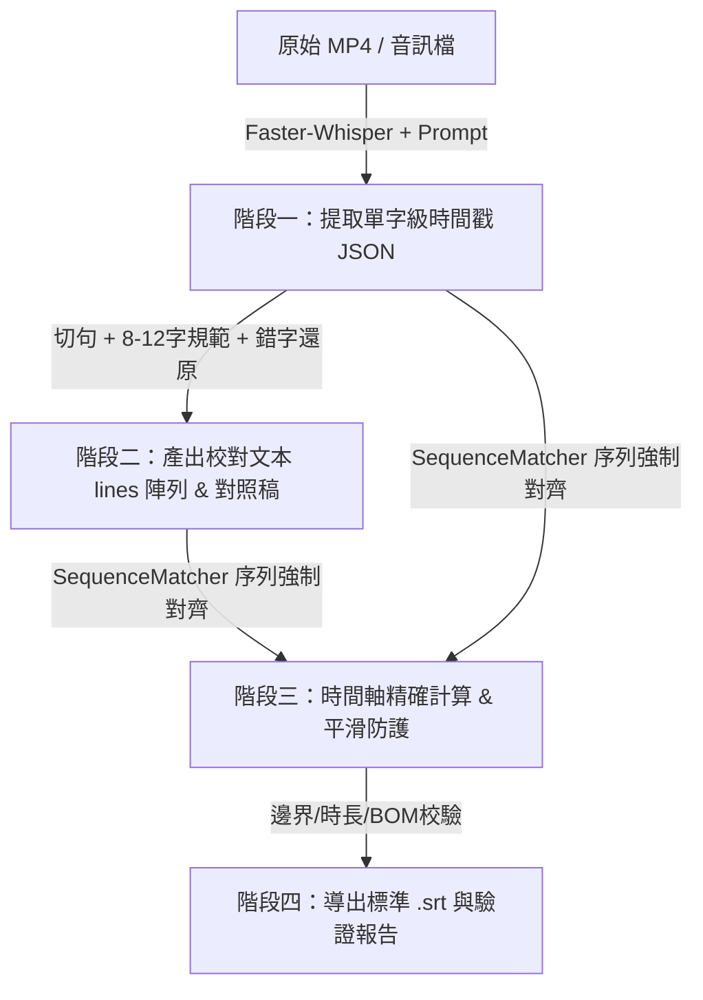

# 影視級 AI 字幕製作方法論與標準作業程序（SOP）
> **Broadcast-Grade Subtitle Production Methodology & Standard Operating Procedure**

---

## 前言：為什麼傳統自動字幕多數「不堪入目」？

在短影音與長視頻爆發的時代，市面上充斥著各種一鍵生成字幕的工具（如剪映自動字幕、YouTube 自動生成字幕等）。然而，這類字幕在專業影視或深度解說影片中往往存在四大致命問題：

1. **視覺長度忽長忽短**：一行只有兩三個字，下一行卻暴增到二十幾個字，觀眾視線在螢幕上疲於奔命；
2. **語意粗暴腰斬**：機械式按照秒數或標點切分，經常把人名或專有名詞硬生生切斷（例如上一行「史蒂夫·」，下一行「賈伯斯」；或者上一行「Windows」，下一行「95」）；
3. **同音錯字成災**：語音辨識（ASR）缺乏領域知識，聽音胡亂配字（例如將「收費牆築得簡直比天還要高」辨識為「收貝強豬的劍指比天還要高」；將「偷偷撬開門去偷電視機」辨識為「偷店試機」）；
4. **時間戳漂移與亂碼**：字幕在畫面上停留時間太短造成「閃爍」，或者字幕切換時互相重疊，甚至匯入剪輯軟體時因為 UTF-8 無 BOM 產生全面亂碼。

本方法論旨在建立一套**「AI 單字級聽音精度 ＋ 領域知識庫注入 ＋ 影視級口語呼吸斷句 ＋ 序列強制對齊演算法」**的工業級標準作業程序，產出讓觀眾閱讀舒適、語意完整、專有名詞 100% 準確的高品質字幕。

---

## 一、 四大核心原則（Four Golden Principles）

影視級字幕的核心並非單純「把聽到的聲音轉成文字」，而是**「以觀眾的視線軌跡與大腦理解負擔為中心」**的閱讀設計。

```text
┌────────────────────────────────────────────────────────────────────────┐
│                        影視級字幕四大黃金原則                          │
├───────────────────┬────────────────────────────────────────────────────┤
│ 原則一：黃金視線帶 │ 單行 8 ～ 12 個中文字（極限不超過 16 字，嚴禁腰斬）│
│ 原則二：口語呼吸律 │ 依人類自然呼吸停頓與語法意群斷句，而非機械依秒數   │
│ 原則三：名詞零容忍 │ 注入領域知識庫，徹底逆向還原同音錯字與專業術語     │
│ 原則四：單調無重疊 │ 時間戳嚴格單調遞增，設定最小顯示保護，UTF-8 with BOM│
└───────────────────┴────────────────────────────────────────────────────┘
```

### 原則一：單行字數的「黃金視線帶」（8 ～ 12 字）
- **生理基礎**：人眼在不轉動眼球的情況下，水平餘光一次能瞬間識別的最佳中文字長度約為 8 到 12 個字。
- **閱讀速度**：中文語音正常語速為每秒 3～4 個字。一行 8～12 字的字幕在螢幕上停留 2～3 秒，恰好與大腦閱讀認知節奏同步。
- **長度邊界控制**：
  - **下限**：除非是呼應強烈情緒的感嘆詞（如「天啊！」、「沒錯！」），原則上避免出現小於 4 個字的破碎行。
  - **上限**：單行嚴格禁止超過 16 個中文字。超過 16 字必須依子句文意拆分為兩行。

### 原則二：人類自然口語呼吸節奏（Spoken Cadence & Phrasing）
- **拒絕標點依賴**：中文日常口語往往「一逗到底」或句型極長。如果只在句號、問號處斷句，字幕長度必定失控。
- **意群完整性（Constituency）**：斷句處必須落在**語法結構的邊界**（如主語與謂語之間、子句銜接處、轉折連詞之前）。
- **專有名詞不可分割**：人名、技術名、產品型號絕不能跨行拆開。

### 原則三：專有名詞 100% 精準與同音錯字逆向還原
- **語境還原法（Contextual Phonetic Restoration）**：
  ASR 產出的錯字往往保留了正確的漢語拼音或聲調。校對者必須結合同期科技史實，從荒謬的字面還原背後的本意。
  - *實戰案例 1*：「收貝強豬的劍指比天還要高」 ➔ 聲韻：shōubèi qiángzhū... ➔ 正確：**「收費牆築得簡直比天還要高」**
  - *實戰案例 2*：「騙過系統退避」 ➔ 聲韻：tuìbì ➔ 科技背景：公用電話 2600Hz 切斷幹線但保持連通 ➔ 正確：**「騙過系統退幣」**
  - *實戰案例 3*：「出路瘋狂」 ➔ 聲韻：chūlù fēngkuáng ➔ 賈伯斯與沃茲初次聯手 ➔ 正確：**「初露鋒芒」**
  - *實戰案例 4*：「偷店試機」 ➔ 蓋茲名言富鄰居 ➔ 正確：**「偷電視機」**
  - *實戰案例 5*：「不可思議的復全感」 ➔ 賈伯斯訪談原詞 empowerment ➔ 正確：**「不可思議的賦權感」**

### 原則四：時間軸單調遞增與工業級安全防護
- **單調遞增（Monotonicity）**：每一條字幕的起始時間必須大於或等於上一條字幕的起始時間；每一條字幕的結束時間必須大於起始時間。
- **無重疊安全間隙（No Overlap）**：前後兩條字幕的時間區間不能重疊，否則部分電視播放器或剪輯軌道會發生跳字或覆蓋。
- **最小顯示時間保護（Minimum Display Duration）**：人眼辨識文字並傳導至大腦至少需 0.35～0.5 秒。若語句極快，強制擴展至至少 0.5～0.8 秒，防止畫面出現「閃爍跳過」。
- **標準編碼規範**：一律採用 `UTF-8 with BOM`（十六進位 `EF BB BF` 標頭）。未帶 BOM 的 UTF-8 檔案在繁體/簡體中文 Windows 系統的 Adobe Premiere、Final Cut Pro、剪映或 DaVinci Resolve 中常被誤判為 ANSI/Big5/GBK，引發大規模亂碼。

---

## 二、 四階段標準作業程序（4-Stage SOP）



### 階段一：注入領域提示的單字級音訊轉錄（Word-Level ASR Transcription）

1. **引擎選擇**：使用 `faster-whisper`（基於 CTranslate2 推理引擎），速度比 OpenAI 原版 Whisper 快 4 倍，且具備超高穩定性。
2. **關鍵設定**：
   - 啟用 `word_timestamps=True`：提取語音中每個單字（或漢字）的微秒級 `start` 與 `end`。
   - 注入 `initial_prompt`：這是解決專有名詞辨識率的關鍵秘訣！在 prompt 中主動列出影片涉及的人名、公司名、專業縮寫與時代名詞，強迫模型在解碼時提高這些詞彙的權重。
3. **產出格式**：儲存為 `whisper_words_[主題].json`，包含全文純文字與包含所有單字的陣列。

### 階段二：影視節奏斷句與專家級人工校對（Cadence Splitting & Proofreading）

1. 將語音辨識的初稿按標點或語音停頓切分為長句。
2. 遵循「原則一（8-12字）」與「原則二（口語呼吸律）」，將長句精準切分為節奏明快的短行列表 `lines = [...]`。
3. 遵循「原則三（名詞零容忍）」，逐句校正 ASR 的同音錯字。
4. 生成純文字格式的《字幕校對稿_請確認.txt》，便於人工逐字複查。

### 階段三：基於字元序列匹配的強制時間軸對齊（Sequence Forced Alignment）

**核心技術難點**：
人工校對過後的字幕文字，與 ASR 原始辨識出的字串在字元上已經不完全相同（因為錯字被修正、多餘虛詞被刪除、標點被規範）。傳統的單純計數法會發生時間軸嚴重漂移！

**解決方案**：
採用動態規劃的字元序列匹配演算法（`difflib.SequenceMatcher`）：
1. 分別提取 Whisper 原始辨識字串與人工校對字串的**純字元流**（過濾所有空格與標點符號）；
2. 執行最長公共子序列（LCS）匹配，計算全域對齊區塊（Matching Blocks）；
3. 建立人工校對字元至 Whisper 字元的映射索引；
4. 對於未匹配的字元（如修正後的專有名詞），採用線性內插法（Interpolation）補齊時間軸；
5. 根據校對行（Line）的邊界，抓取首字起始時間與末字結束時間，作為該字幕行的起訖時間戳。

### 階段四：工業級邊界檢查、格式導出與影音驗證（Validation & Export）

在生成最終檔案前，執行自動化驗證腳本：
- **時序檢查**：驗證 Start < End 且 Start(i) >= End(i-1)；
- **長度統計**：檢查全片字幕平均長度是否在 9～12 字之間，揪出超過 16 字的極端行；
- **邊界保護**：最後一條字幕的結束時間不可超過音訊總長度；
- **編碼寫入**：以 `utf-8-sig` 編碼寫入 `.srt` 檔案與校對稿 `.txt`。

---

## 三、 完整 Python 實戰代碼骨幹（Reference Implementation）

以下提供完整的生產級代碼模組，可直接用於任何專題視頻的字幕製作流程。

### 1. 階段一：`extract_whisper.py`（音訊轉錄）

```python
# -*- coding: utf-8 -*-
import json
import time
import os
from faster_whisper import WhisperModel

def extract_audio_words(video_path: str, output_json: str, domain_prompt: str):
    print(f"[1/4] 載入 faster-whisper (small) 模型...")
    model = WhisperModel("small", device="cpu", compute_type="int8")
    
    print(f"[2/4] 正在分析音訊並提取單字級時間戳: {video_path}")
    start_t = time.time()
    segments, info = model.transcribe(
        video_path,
        language="zh",
        initial_prompt=domain_prompt,
        word_timestamps=True,
        beam_size=5
    )
    
    all_words = []
    full_text = []
    
    for segment in segments:
        full_text.append(segment.text)
        if segment.words:
            for w in segment.words:
                all_words.append({
                    "start": round(w.start, 3),
                    "end": round(w.end, 3),
                    "word": w.word,
                    "probability": round(getattr(w, 'probability', 1.0), 3)
                })
                
    dur = time.time() - start_t
    print(f"[3/4] 辨識完成，耗時 {dur:.1f} 秒，共提取 {len(all_words)} 個單字/詞彙。")
    
    data = {
        "text": "".join(full_text),
        "words": all_words
    }
    
    with open(output_json, "w", encoding="utf-8") as f:
        json.dump(data, f, ensure_ascii=False, indent=2)
    print(f"[4/4] 已儲存單字級中繼檔至: {output_json}")

if __name__ == "__main__":
    prompt = (
        "這是一段科技歷史解說影片。人物包含：賈伯斯、沃茲尼克、比爾蓋茲。"
        "專有名詞：麥金塔、全錄PARC、Alto、GUI圖形介面、滑鼠、下拉選單。"
    )
    extract_audio_words("video.mp4", "whisper_words.json", prompt)
```

---

### 2. 階段三：`generate_srt.py`（序列強制對齊與生成）

```python
# -*- coding: utf-8 -*-
import json
import re
import difflib

def format_timestamp(seconds: float) -> str:
    """將浮點秒數轉換為標準 SRT 時間格式 (HH:MM:SS,mmm)"""
    millis = int(round(seconds * 1000))
    hours = millis // 3600000
    millis %= 3600000
    minutes = millis // 60000
    millis %= 60000
    secs = millis // 1000
    millis %= 1000
    return f"{hours:02d}:{minutes:02d}:{secs:02d},{millis:03d}"

def generate_srt_with_alignment(whisper_json_path: str, approved_lines: list, output_srt_path: str, proof_txt_path: str):
    # 1. 讀取 Whisper 單字級資料
    with open(whisper_json_path, 'r', encoding='utf-8') as f:
        whisper_data = json.load(f)
    whisper_words = whisper_data['words']

    # 2. 抽取 Whisper 的純字元流與單字映射
    whisper_chars = []
    whisper_char_to_word = []
    for w_idx, w in enumerate(whisper_words):
        for c in w['word']:
            clean_c = re.sub(r'[^\w]', '', c.lower())
            if clean_c:
                whisper_chars.append(clean_c)
                whisper_char_to_word.append(w_idx)
    whisper_full_str = ''.join(whisper_chars)

    # 3. 抽取校對後文字的純字元流與行邊界
    approved_char_boundaries = []
    approved_chars = []
    curr_idx = 0
    for l in approved_lines:
        clean_l = re.sub(r'[^\w]', '', l.lower())
        st = curr_idx
        ed = curr_idx + len(clean_l)
        approved_char_boundaries.append((st, ed))
        approved_chars.extend(list(clean_l))
        curr_idx = ed
    approved_full_str = ''.join(approved_chars)

    # 4. 執行 SequenceMatcher 序列全域強制匹配
    matcher = difflib.SequenceMatcher(None, whisper_full_str, approved_full_str)
    print(f"字元級序列匹配度: {matcher.ratio() * 100:.2f}%")

    blocks = matcher.get_matching_blocks()
    app_to_whisp = [None] * len(approved_full_str)
    for b in blocks:
        w_st, a_st, size = b.a, b.b, b.size
        for i in range(size):
            app_to_whisp[a_st + i] = w_st + i

    # 針對未匹配字元進行雙向線性內插
    last_mapped = 0
    for i in range(len(app_to_whisp)):
        if app_to_whisp[i] is None:
            next_mapped = len(whisper_full_str) - 1
            for j in range(i + 1, len(app_to_whisp)):
                if app_to_whisp[j] is not None:
                    next_mapped = app_to_whisp[j]
                    break
            app_to_whisp[i] = min(max(last_mapped, int(round((last_mapped + next_mapped) / 2))), len(whisper_full_str) - 1)
        else:
            last_mapped = app_to_whisp[i]

    # 5. 組合字幕條目
    subtitles = []
    for l_idx, (st_c, ed_c) in enumerate(approved_char_boundaries):
        text = approved_lines[l_idx]
        if st_c == ed_c:
            continue
        w_st_idx = app_to_whisp[st_c]
        w_ed_idx = app_to_whisp[min(ed_c - 1, len(app_to_whisp) - 1)]

        word_s = whisper_char_to_word[w_st_idx]
        word_e = whisper_char_to_word[w_ed_idx]

        st_time = whisper_words[word_s]['start']
        ed_time = whisper_words[word_e]['end']

        subtitles.append({
            'index': l_idx + 1,
            'start': st_time,
            'end': ed_time,
            'text': text
        })

    # 6. 單調性修正、重疊消除與最小顯示時間平滑
    for i in range(len(subtitles)):
        if i > 0:
            if subtitles[i]['start'] < subtitles[i-1]['start']:
                subtitles[i]['start'] = subtitles[i-1]['start']
            if subtitles[i]['start'] < subtitles[i-1]['end']:
                subtitles[i-1]['end'] = subtitles[i]['start']
                if subtitles[i-1]['end'] - subtitles[i-1]['start'] < 0.35:
                    subtitles[i-1]['end'] = subtitles[i-1]['start'] + 0.35
                    subtitles[i]['start'] = subtitles[i-1]['end']
        if subtitles[i]['end'] <= subtitles[i]['start']:
            subtitles[i]['end'] = subtitles[i]['start'] + 0.8

    # 7. 導出 UTF-8 with BOM 的標準 SRT
    with open(output_srt_path, "w", encoding="utf-8-sig") as f:
        for s in subtitles:
            f.write(f"{s['index']}\n")
            f.write(f"{format_timestamp(s['start'])} --> {format_timestamp(s['end'])}\n")
            f.write(f"{s['text']}\n\n")

    # 8. 導出人工校對底稿 TXT
    with open(proof_txt_path, "w", encoding="utf-8-sig") as f:
        f.write("【專題影片字幕校對底稿】\n")
        f.write("規範：每行 8～12 字黃金長度、自然呼吸斷句、專有名詞 100% 準確校正。\n\n")
        for i, s in enumerate(subtitles):
            f.write(f"{i+1:03d}. [{format_timestamp(s['start'])} -> {format_timestamp(s['end'])}] {s['text']}\n")

    print(f"成功導出 {len(subtitles)} 條字幕至 {output_srt_path}")
```

---

### 3. 階段四：`validate_srt.py`（品質自動驗證器）

```python
# -*- coding: utf-8 -*-
import os
import re

def validate_srt(srt_path: str):
    with open(srt_path, "rb") as f:
        header = f.read(3)
        assert header == b'\xef\xbb\xbf', "錯誤：缺少 UTF-8 BOM 標頭 (EF BB BF)！"

    with open(srt_path, "r", encoding="utf-8-sig") as f:
        content = f.read().strip()

    blocks = content.split("\n\n")
    time_pattern = re.compile(r"(\d{2}):(\d{2}):(\d{2}),(\d{3}) --> (\d{2}):(\d{2}):(\d{2}),(\d{3})")
    
    def to_millis(h, m, s, ms):
        return int(h)*3600000 + int(m)*60000 + int(s)*1000 + int(ms)

    prev_end = 0
    durations = []
    lengths = []
    errors = []

    for i, b in enumerate(blocks):
        lines = b.splitlines()
        idx = int(lines[0].strip())
        assert idx == i + 1, f"序號錯誤：第 {i+1} 條序號為 {idx}"
        
        m = time_pattern.match(lines[1].strip())
        st = to_millis(*m.groups()[:4])
        ed = to_millis(*m.groups()[4:])
        
        if ed <= st:
            errors.append(f"第 {i+1} 條時長非正數: {st} -> {ed}")
        if st < prev_end - 10:
            errors.append(f"第 {i+1} 條與上一條重疊: prev_end={prev_end}, st={st}")
            
        durations.append((ed - st) / 1000.0)
        clean_text = re.sub(r'[^\w]', '', "".join(lines[2:]))
        lengths.append(len(clean_text))
        prev_end = ed

    print("=== 字幕品質檢驗報告 ===")
    print(f"總字幕行數: {len(durations)} 條")
    print(f"平均顯示時長: {sum(durations)/len(durations):.2f} 秒 (最小: {min(durations):.2f}s, 最大: {max(durations):.2f}s)")
    print(f"平均單行字數: {sum(lengths)/len(lengths):.1f} 字 (最少: {min(lengths)} 字, 最多: {max(lengths)} 字)")
    print(f"時序錯誤總數: {len(errors)}")
    if not errors:
        print(">> 驗證結果：全數通過，具備影視上線標準！")
```

---

## 四、 經典同音錯字逆向還原案例庫（Real-world Cases）

以下收錄真實專題製作過程中所遭遇的 ASR 典型錯字與修正依據，供後續專題製作參考對照：

| 專題主題 | ASR 原始辨識語音 | 影視標準修正 | 歷史背景與還原邏輯 |
| :--- | :--- | :--- | :--- |
| **麥金塔大劫案** | 全路Park / 全路Auto | **全錄 PARC / 全錄 Alto** | Xerox PARC 研究中心與 Alto 工作站 |
| **麥金塔大劫案** | 充滿戲劇室 / 西谷光緩 | **充滿戲劇性 / 矽谷光環** | 語境連音口誤修復 |
| **麥金塔大劫案** | 硬硬機 / 磨豆 | **影印機 / 魔豆** | 全錄只懂賣影印機；賈伯斯用股票魔豆換金山 |
| **麥金塔大劫案** | 圓球圓 / 城市設計的十組 | **研究員 / 程式設計的始祖** | 指 Smalltalk 物件導向語言 |
| **麥金塔大劫案** | 徒刑使用者介面 | **圖形使用者介面（GUI）** | Graphical User Interface |
| **麥金塔大劫案** | 波爾爾·斯密斯 / 蘇省凱爾 | **伯勒爾·史密斯 / 蘇珊·凱爾** | 麥金塔核心軟硬體設計師 |
| **麥金塔大劫案** | 營運殺手 / 雷力.scout | **《銀翼殺手》/ 雷利·史考特** | 執導超級盃《1984》廣告的導演 Ridley Scott |
| **麥金塔大劫案** | 超友前鄰居 / 偷店試機 | **超有錢鄰居 / 偷電視機** | 比爾·蓋茲回擊賈伯斯名言 |
| **麥金塔大劫案** | 一刀並命 | **一刀斃命** | 蓋茲這句話直接點破這場技術劫案的本質 |
| **電話飛客** | 收貝強豬的劍指比天還要高 | **收費牆築得簡直比天還要高** | AT&T 1970 年代昂貴的天價長途通話費 |
| **電話飛客** | 代內信令 | **帶內信令（In-band Signaling）** | 2600Hz 控制音頻與語音塞在同一通道的架構漏洞 |
| **電話飛客** | 騙過系統退避 | **騙過系統退幣** | 公用電話吹 2600Hz 哨音騙過計費系統並退幣 |
| **電話飛客** | 害石英震槓器 / 出路瘋狂 | **和石英震盪器 / 初露鋒芒** | 沃茲尼克數位藍盒子晶振；兩人合作初露鋒芒 |
| **電話飛客** | 不可思議的復全感 | **不可思議的賦權感（Empowerment）** | 賈伯斯 1994 年專訪原詞 |
| **Gmail 誕生** | 獰貓專案 / 20% 自由時間 | **Project Caribou / 20% Time** | 保羅·布赫海特秘密開發專案與 Google 文化 |
| **Gmail 誕生** | 白屏詛咒 / 局部抽換 | **白屏詛咒 / DOM 局部抽換** | Ajax 與 XMLHttpRequest 前端技術革命 |
| **第一次瀏覽器大戰** | 網劇 / 往近 / NASCAP | **網景（Netscape）/ 那斯達克** | 1995 年網景上市掀起網路巨浪 |
| **第一次瀏覽器大戰** | 寶羅馬里自 / 抽乾氧氣 | **保羅·馬里茨（Paul Maritz）** | 微軟高層下達 Cut off their air supply 焦土令 |
| **Linux 誕生** | 塔能鮑姆 / 咪逆克斯 | **塔能鮑姆（Tanenbaum）/ MINIX** | 微核心 vs 單核心著名世紀大論戰 |

---

## 五、 成果檢驗核對清單（Checklist）

在上傳 YouTube 或匯入剪輯軟體前，請逐一勾選確認：

- [ ] **檔案格式**：附檔名為 `.srt`，編碼確認為 `UTF-8 with BOM`。
- [ ] **排版節奏**：單行中文字數維持在 8～12 字，無極端長句（>16字）或破碎短句。
- [ ] **名詞校對**：人名、技術名、產品型號均已還原為業界標準官方譯名。
- [ ] **無重疊性**：前後行字幕無毫秒級時間重疊。
- [ ] **語音同步**：抽查開頭、中間高潮段落與片尾三處，聲音發音起點與字幕顯示起點完全契合。
- [ ] **隨附底稿**：已同步產生 `.txt` 人工審閱稿留存備查。

---
*本 SOP 規範已全面落實於本專案全數科技歷史專題影片字幕產出流程中。*
